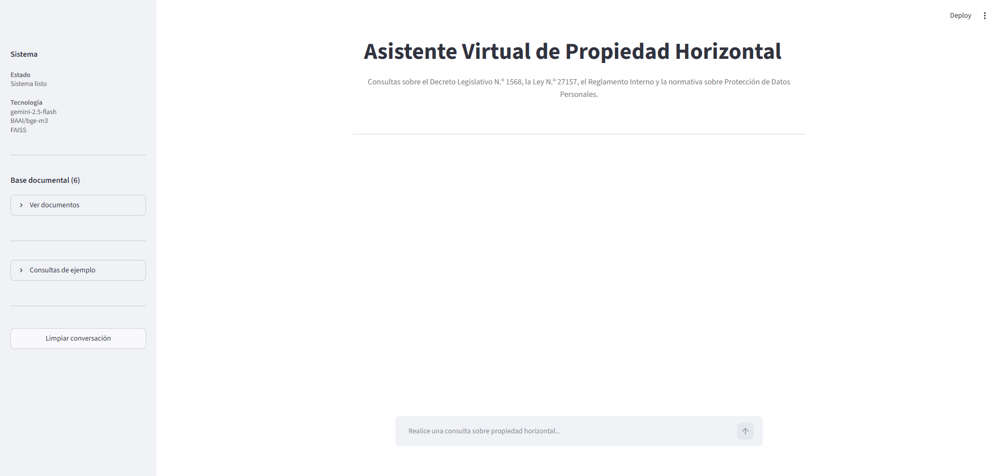
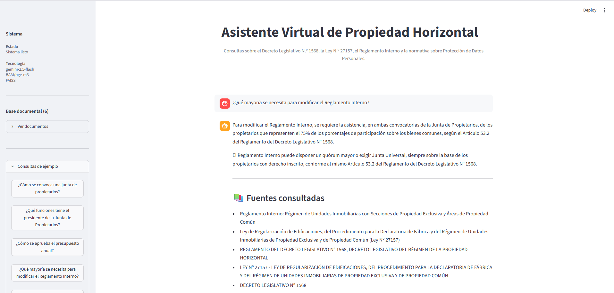

# Asistente Virtual de Propiedad Horizontal - RAG 🇵🇪

Aplicación de Inteligencia Artificial Generativa orientada a la consulta de normativa peruana sobre propiedad horizontal.

El sistema utiliza una arquitectura **RAG (Retrieval-Augmented Generation)** para recuperar información relevante desde documentos normativos y generar respuestas fundamentadas mediante un modelo de lenguaje (LLM).

El objetivo del proyecto es explorar la aplicación práctica de agentes inteligentes en escenarios legales y administrativos, donde la precisión documental y la trazabilidad de las respuestas son elementos clave.

---

## 🚀 Demo

**Aplicación desplegada:**

🔗 [Streamlit Cloud - Asistente Virtual de Propiedad Horizontal](https://agente-toscana.streamlit.app/)


### Capturas de funcionamiento





---

# 📌 Características principales

- Consultas en lenguaje natural sobre normativa de propiedad horizontal en Perú.
- Recuperación semántica de información desde documentos legales.
- Generación de respuestas mediante modelos LLM.
- Referencia de fuentes documentales utilizadas.
- Interfaz web simple desarrollada en Streamlit.
- Base vectorial local para almacenamiento y búsqueda eficiente.
- Arquitectura preparada para incorporar nuevos modelos y fuentes documentales.

---

# 🏛️ Fuentes documentales actuales

El sistema trabaja actualmente con:

- Decreto Legislativo N.º 1568 - Régimen de Propiedad Horizontal.
- Ley N.º 27157.
- Reglamento Interno.
- Normativa relacionada al tratamiento de datos personales.

Las fuentes documentales pueden ampliarse incorporando nuevos documentos en formato Markdown.

---

# 🧠 Arquitectura del Sistema

Flujo general:
```
Documentos legales
|
v
Procesamiento documental
|
v
Embeddings
|
v
FAISS Vector Store
|
v
Consulta del usuario
|
v
Recuperación de contexto
|
v
LLM
|
v
Respuesta generada
```
Los documentos legales pasan por un proceso de limpieza, estructuración e indexación antes de incorporarse a la base vectorial. Este procesamiento se realiza una única vez y permite optimizar la recuperación semántica durante las consultas.
Para una explicación detallada:

➡️ Ver [Arquitectura del sistema](docs/architecture.md)

---

## 🛠️ Tecnologías utilizadas
```
| Componente | Tecnología |
|------------|------------|
| Lenguaje | Python |
| Interfaz web | Streamlit |
| Framework RAG | LangChain |
| Modelo generativo | Google Gemini |
| Embeddings | BAAI/bge-m3 |
| Base vectorial | FAISS |
| Procesamiento documental | Markdown Header Splitter + Recursive Character Splitter |
| Gestión de configuración | python-dotenv |
```
Para conocer el detalle de la implementación:

➡️ Ver [Procesamiento](docs/document_processing.md)

---

## 📂 Estructura del proyecto
```
├── app.py                     # Interfaz web desarrollada con Streamlit
├── src/
│   ├── agent.py               # Implementación del agente RAG
│   └── data_cleaner.py        # Limpieza y transformación de documentos PDF a Markdown
│   └── vector_store/              # Índice vectorial FAISS persistido
├── prompts/
│   └── legal_agent.md         # Prompt principal utilizado por el LLM
├── data/                      # Documentos fuente en formato Markdown
├── docs/                      # Documentación técnica del proyecto
├── styles.css                 # Estilos personalizados de la interfaz
├── requirements.txt           # Dependencias de Python
├── .env.example               # Ejemplo de variables de entorno
└── README.md                  # Presentación general del proyecto
```
---

## 📚 Documentación

La documentación técnica se encuentra organizada por temas para mantener este README como una vista general del proyecto.

| Documento | Descripción |
|-----------|-------------|
| [architecture.md](docs/architecture.md) | Arquitectura general y componentes del sistema. |
| [document_processing.md](docs/document_processing.md) | Flujo completo del procesamiento documental y la arquitectura RAG. |
| [setup.md](docs/setup.md) | Instalación, configuración y ejecución del proyecto. |
| [decisions.md](docs/decisions.md) | Principales decisiones técnicas y criterios de diseño adoptados. |
| [experiments.md](docs/experiments.md) | Registro de experimentos realizados y líneas de investigación futuras. |
| [troubleshooting.md](docs/troubleshooting.md) | Problemas encontrados durante el desarrollo y sus soluciones. |

---

## Experimentos futuros

Pruebas pendientes y líneas de mejora:

- Comparación entre modelos LLM.
- Evaluación de diferentes embeddings.
- Optimización de recuperación documental.
- Nuevas estrategias RAG.

➡️ [docs/experiments.md](docs/experiments.md)

---

## 🚧 Estado actual

El proyecto cuenta con un MVP funcional:

✅ Pipeline RAG operativo.  
✅ Indexación documental mediante FAISS.  
✅ Consultas mediante lenguaje natural.  
✅ Integración con modelo LLM.  
✅ Interfaz web desplegada.  
✅ Gestión de fuentes documentales.

