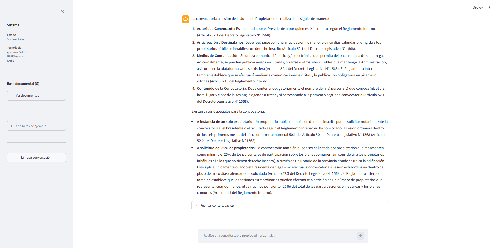
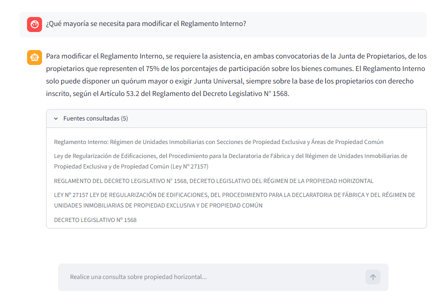
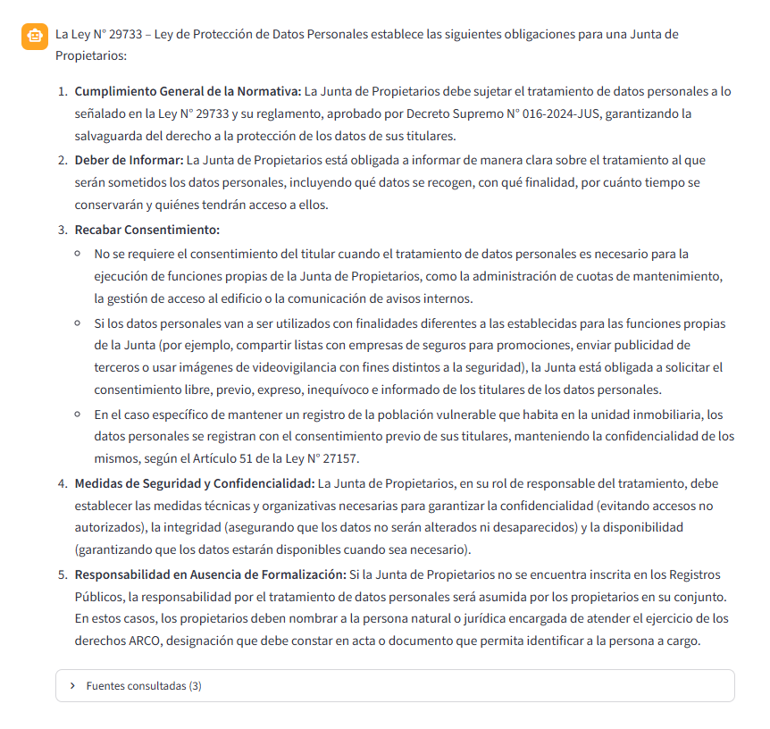

# Ejemplos de uso

← [Volver al README](../README.md)

---

# Ejemplo 1 - Convocatoria de Junta de Propietarios

## Consulta

> ¿Cómo se convoca una junta de propietarios?

## Captura



## Respuesta (extracto)

```text
La convocatoria a sesión de la Junta de Propietarios se realiza de la siguiente manera:
Autoridad Convocante: Es efectuada por el Presidente ...
Anticipación y Destinatarios: Debe realizarse con una anticipación no menor a cinco días calendario...
Medios de Comunicación: Se utiliza comunicación física y/o electrónica que permita dejar constancia de su entrega...
Contenido de la Convocatoria: Debe contener obligatoriamente ...
Existen casos especiales para la convocatoria:
A instancia de un solo propietario...
A solicitud del 25% de propietarios...
```

## Normativa consultada

- Decreto Legislativo N.º 1568
- Reglamento Interno

---

# Ejemplo 2 - Modificación del Reglamento Interno

## Consulta

> ¿Qué mayoría se requiere para modificar el Reglamento Interno?

## Captura



## Respuesta (extracto)

```text
Para modificar el Reglamento Interno, se requiere la asistencia, en ambas convocatorias de la Junta de Propietarios, de los propietarios que representen el 75% de los porcentajes de participación sobre los bienes comunes. El Reglamento Interno solo puede disponer un quórum mayor o exigir Junta Universal, siempre sobre la base de los propietarios con derecho inscrito, según el Artículo 53.2 del Reglamento del Decreto Legislativo N° 1568.
```

## Normativa consultada

- Reglamento Interno
- Ley Nº 27157
- Decreto Legislativo N.º 1568

---

# Ejemplo 3 - Protección de Datos Personales

## Consulta

> ¿Qué obligaciones establece la Ley de Protección de Datos Personales para una Junta de Propietarios?

## Captura



## Respuesta (extracto)

```text
La Ley N° 29733 – Ley de Protección de Datos Personales establece las siguientes obligaciones para una Junta de Propietarios:

Cumplimiento General de la Normativa: La Junta de Propietarios debe sujetar el tratamiento de datos personales a lo señalado en la Ley N° 29733 y su reglamento, aprobado por Decreto Supremo N° 016-2024-JUS, garantizando la salvaguarda del derecho a la protección de los datos de sus titulares.
Deber de Informar...
Recabar Consentimiento...
No se requiere el consentimiento del titular cuando...
Medidas de Seguridad... 
Responsabilidad...
```

## Normativa consultada

- Guía para el tratamiento de datos personales en edificios

---

## Observaciones

Los ejemplos presentados corresponden a consultas reales realizadas sobre la aplicación. Las respuestas pueden variar conforme se incorporen nuevos documentos, modelos de lenguaje o mejoras en el proceso de recuperación de información (RAG).

---

← [Volver al README](../README.md)